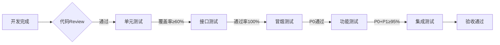

# 缅甸房产平台 - 测试计划

**文档版本**: v1.0
**创建日期**: 2026-03-29
**适用范围**: C端APP、B端APP、管理后台、后端API

---

## 🔐 测试环境信息

> ⚠️ **安全提醒**: 以下信息仅限项目内部使用，请勿外传

### 测试服务器

| 项目 | 信息 |
|------|------|
| **服务器地址** | 43.163.122.42 |
| **SSH账号** | ubuntu |
| **SSH密码** | Rh[HS#)6Z$YNs8bw |
| **API地址** | http://43.163.122.42:8080 |
| **Web Admin** | http://43.163.122.42:8000 |

### 环境用途
- 冒烟测试
- 回归测试
- P0/P1功能测试
- Bug修复验证

### 登录方式
```bash
ssh ubuntu@43.163.122.42
# 密码: Rh[HS#)6Z$YNs8bw
```

---

## 一、概述

### 1.1 项目背景

缅甸房产平台是一个完整的房产交易解决方案，包含：
- **C端APP**: Flutter买家应用
- **B端APP**: Flutter经纪人应用
- **Web Admin**: React管理后台
- **后端API**: Go微服务架构

**技术栈**: Flutter 3.19 + Go 1.21 + PostgreSQL 15 + Redis 7

### 1.2 测试目标

| 目标 | 指标 | 说明 |
|------|------|------|
| 功能覆盖率 | ≥ 90% | 核心业务流程100%覆盖 |
| P0用例通过率 | 100% | 129个核心用例全部通过 |
| P1用例通过率 | ≥ 95% | 52个重要用例 |
| 缺陷密度 | < 0.5个/功能点 | 发布后生产环境缺陷 |
| 接口测试覆盖 | 100% | 所有后端接口 |

### 1.3 测试范围

**包含范围**:
- 用户模块（注册、登录、认证）
- 房源模块（发布、搜索、管理）
- IM模块（消息通信）
- 预约模块（带看预约）
- ACN模块（分佣计算）
- 管理后台（用户/房源/财务/系统管理）

**不包含范围**:
- 微信支付集成（待接入）
- 地图画圈找房（二期功能）
- 跨品牌ACN协作（暂不支持）

---

## 二、测试用例概览

### 2.1 用例统计

| 模块 | 用例数 | P0 | P1 | P2 | 覆盖率 |
|------|--------|-----|-----|-----|--------|
| C端APP | 63 | 38 | 20 | 5 | 92% |
| B端APP | 39 | 27 | 9 | 3 | 84% |
| 管理后台 | 36 | 25 | 9 | 2 | 90% |
| 接口测试 | 47 | 39 | 7 | 1 | 82% |
| 兼容性测试 | 13 | 7 | 4 | 2 | - |
| **合计** | **195** | **129** | **52** | **14** | **89%** |

### 2.2 优先级分布

```
P0 核心用例 (66.2%): ████████████████████████████████ 129个
P1 重要用例 (26.7%): █████████████ 52个
P2 一般用例 (7.2%):  ███ 14个
```

### 2.3 测试类型分布

| 类型 | 数量 | 占比 | 主要覆盖 |
|------|------|------|----------|
| 功能测试 | 158 | 81.0% | 业务功能验证 |
| 接口测试 | 47 | 24.1% | API正确性验证 |
| 兼容性测试 | 13 | 6.7% | 设备/系统适配 |

---

## 三、测试策略

### 3.1 测试金字塔

```
        /\
       /  \      E2E测试 (少量) - 主流程覆盖
      /----\
     /      \    集成测试 (中等) - 模块间交互
    /--------\
   /          \  单元测试 (大量) - 函数/组件
  /------------\
```

### 3.2 测试分层策略

| 层级 | 测试类型 | 负责人 | 工具/方法 |
|------|----------|--------|-----------|
| L1 | 单元测试 | 开发 | Go test, Flutter test |
| L2 | 接口测试 | 测试/开发 | Postman, JMeter |
| L3 | 集成测试 | 测试 | 自动化脚本 |
| L4 | 系统测试 | 测试 | 手工+自动化 |
| L5 | 验收测试 | 产品/业务 | UAT |

### 3.3 质量门禁



---

## 四、测试阶段

### 4.1 冒烟测试

**目标**: 快速验证核心功能可用

| 项目 | 详情 |
|------|------|
| 用例范围 | 所有P0用例 (129个) |
| 执行时间 | 2人天 |
| 通过标准 | 100%通过 |
| 执行频率 | 每次构建后 |

**冒烟测试清单**:
- [x] Docker服务状态检查
- [x] API健康检查
- [x] 数据库连接测试
- [x] Redis连接测试
- [x] 用户注册/登录流程
- [x] 房源搜索功能
- [x] IM消息收发
- [x] 预约创建/确认

### 4.2 Bug修复与回归测试流程

**发现Bug后的标准处理流程**（更新于2026-03-29）：

| 步骤 | 动作 | 负责人 | 输出 |
|------|------|--------|------|
| 1 | 确认Bug | 测试 | Bug详细描述 |
| 2 | 修复代码 | 开发 | 代码提交 |
| 3 | 部署到测试环境 | 测试/运维 | 部署完成确认 |
| 4 | 回归测试 | 测试 | 回归测试结果 |
| 5 | 更新测试进展 | 测试 | test-progress.md更新 |
| 6 | 继续下一阶段 | 测试 | 进入下一步测试 |

**部署命令**（腾讯云测试环境）：
```bash
# 1. SSH登录
ssh ubuntu@43.163.122.42

# 2. 进入项目目录
cd /home/ubuntu/myanmarestate/myanmar-real-estate-kimi

# 3. 拉取最新代码
git pull origin master

# 4. 重新构建并启动API
cd myanmar-real-estate/backend
sudo docker-compose stop api
sudo docker-compose rm -f api
sudo docker-compose build --no-cache api
sudo docker-compose up -d api

# 5. 验证部署
curl http://localhost:8080/health
```

### 4.3 功能测试

**目标**: 全面验证业务功能

| 项目 | 详情 |
|------|------|
| 用例范围 | P0 + P1用例 (181个) |
| 执行时间 | 8人天 |
| 通过标准 | P0:100%, P1:≥95% |
| 执行频率 | 每轮迭代一次 |

**功能模块优先级**:

| 优先级 | 模块 | 风险等级 |
|--------|------|----------|
| 1 | 账号安全 | 高 |
| 2 | 房源搜索 | 高 |
| 3 | 地图找房 | 高 |
| 4 | IM通信 | 中 |
| 5 | 预约带看 | 高 |
| 6 | ACN分佣 | 高 |
| 7 | 验真流程 | 中 |

### 4.4 兼容性测试

**目标**: 验证多端适配

| 项目 | 详情 |
|------|------|
| 用例数 | 13个 |
| 执行时间 | 3人天 |
| 覆盖范围 | Flutter引擎、缅甸本土机型 |

**测试矩阵**:

| 平台 | 版本范围 | 重点设备 |
|------|----------|----------|
| Android | 9.0 - 14.0 | Samsung, Xiaomi, OPPO |
| iOS | 14.0 - 17.0 | iPhone 12/13/14/15系列 |
| Flutter | 3.19.x | 引擎稳定性 |

**兼容性重点**:
- 缅语Unicode显示
- 缅甸时区(UTC+6:30)处理
- 低版本Android适配
- Flutter渲染性能

### 4.5 回归测试

**目标**: 确保修改未引入新问题

| 项目 | 详情 |
|------|------|
| 用例范围 | P0 + P1用例 (181个) |
| 执行时间 | 4人天 |
| 触发条件 | 代码变更、Bug修复后 |
| 通过标准 | P0:100%, P1:≥95% |

### 4.6 性能测试

**目标**: 验证系统承载能力

| 场景 | 指标 | 目标 |
|------|------|------|
| 地图聚合查询 | 响应时间 | < 2s (10万房源) |
| 房源搜索 | 响应时间 | < 500ms |
| IM消息投递 | 延迟 | < 200ms |
| 并发登录 | TPS | > 100 |

**高风险功能**:
- 地图聚合性能（大数据量）
- ACN分佣计算（复杂场景）
- 支付/提现安全

---

## 五、测试环境

### 5.1 环境配置

| 环境 | 地址 | 用途 |
|------|------|------|
| 开发环境 | localhost | 开发自测 |
| 测试环境 | 43.163.122.42 | 功能测试 |
| 预发布环境 | - | 回归测试 |
| 生产环境 | - | 线上运行 |

### 5.2 Docker服务

| 服务 | 容器名 | 端口 | 状态 |
|------|--------|------|------|
| API | myanmar-property-api | 8080 | 运行中 |
| PostgreSQL | myanmar-property-db | 5432 | 运行中 |
| Redis | myanmar-property-redis | 6379 | 运行中 |
| Nginx | myanmar_nginx | 80/443 | 运行中 |
| Web Admin | myanmar_web_admin | 80 | 运行中 |

### 5.3 测试数据准备

**测试账号**:
- C端用户: 20个（不同认证状态）
- B端经纪人: 10个（不同角色）
- 后台管理员: 5个（不同权限）

**测试房源**:
- 出售房源: 100套（不同区域、价格、类型）
- 出租房源: 50套
- 验真状态: 已验真60%、未验真40%

---

## 六、测试执行计划

### 6.1 迭代测试节奏

```
Week 1: 开发 + 单元测试
Week 2: 接口测试 + 冒烟测试
Week 3: 功能测试 + Bug修复
Week 4: 回归测试 + 兼容性测试 + 验收
```

### 6.2 详细执行计划

| 阶段 | 任务 | 负责人 | 工期 | 输出 |
|------|------|--------|------|------|
| 准备 | 测试数据准备 | 测试 | 1天 | 测试数据集 |
| 准备 | 环境部署检查 | 运维 | 0.5天 | 环境就绪确认 |
| 执行 | 冒烟测试 | 测试 | 2天 | 冒烟测试报告 |
| 执行 | 功能测试(P0) | 测试 | 4天 | 功能测试报告 |
| 执行 | 功能测试(P1) | 测试 | 4天 | 功能测试报告 |
| 执行 | Bug修复验证 | 开发 | 3天 | Bug修复报告 |
| 执行 | 接口自动化 | 测试 | 2天 | 接口测试报告 |
| 执行 | 兼容性测试 | 测试 | 3天 | 兼容性报告 |
| 执行 | 回归测试 | 测试 | 4天 | 回归测试报告 |
| 验收 | UAT验收 | 产品 | 2天 | 验收报告 |

**总计**: 约25人天

### 6.3 测试执行检查表

**冒烟测试**:
- [ ] API健康检查通过
- [ ] 数据库连接正常
- [ ] Redis连接正常
- [ ] 用户注册流程完整
- [ ] 用户登录流程完整
- [ ] 房源列表可加载
- [ ] 房源搜索可用
- [ ] IM消息可收发

**功能测试**:
- [ ] C端APP账号模块
- [ ] C端APP首页/搜索
- [ ] C端APP地图/详情
- [ ] C端APP IM/预约
- [ ] B端APP录房/验真
- [ ] B端APP房源/客户管理
- [ ] B端APP ACN/业绩
- [ ] 管理后台用户/房源
- [ ] 管理后台财务/系统

---

## 七、风险评估

### 7.1 风险识别

| 风险 | 等级 | 影响 | 缓解措施 |
|------|------|------|----------|
| ACN分佣计算复杂 | 高 | 财务损失 | 多场景验证、边界测试 |
| 地图聚合性能 | 高 | 用户体验差 | 大数据量压测 |
| 缅甸本地化 | 中 | 功能异常 | 本地化验证 |
| IM实时性 | 中 | 消息延迟 | 弱网测试 |
| Flutter兼容性 | 中 | 闪退/卡顿 | 多机型覆盖 |

### 7.2 待解决问题

| 问题 | 状态 | 影响 | 计划解决 |
|------|------|------|----------|
| Easemob IM集成 | 待办 | IM功能 | 注册环信账号 |
| 缅甸本地支付 | 待办 | 交易闭环 | 接入当地渠道 |
| Elasticsearch搜索 | 待办 | 搜索性能 | 优化索引 |
| GPS地图功能 | 待办 | 地图体验 | 验证定位精度 |

---

## 八、自动化策略

### 8.1 自动化优先级

| 模块 | 优先级 | 可行性 | 建议工具 |
|------|--------|--------|----------|
| 接口测试 | P0 | 高 | Postman/Newman |
| 账号模块 | P1 | 中 | Appium |
| 搜索筛选 | P1 | 高 | Appium |
| 地图功能 | P2 | 低 | 手动测试 |
| IM功能 | P2 | 中 | 自定义工具 |

### 8.2 自动化目标

- 接口自动化覆盖率: 100%
- UI自动化覆盖率: 核心流程(≥60%)
- 冒烟测试自动化: 100%
- 回归测试自动化: ≥70%

---

## 九、交付物

| 文档 | 说明 | 负责人 |
|------|------|--------|
| 测试计划 | 本文档 | 测试 |
| 测试用例 | 195个详细用例 | 测试 |
| 冒烟测试报告 | 每次构建后 | 测试 |
| 功能测试报告 | 每轮测试后 | 测试 |
| 接口测试报告 | 自动化生成 | CI/CD |
| 兼容性报告 | 每轮测试后 | 测试 |
| 回归测试报告 | Bug修复后 | 测试 |
| 验收报告 | 上线前 | 产品 |

---

## 十、附录

### 10.1 参考文档

- [测试用例统计报告](./qa/test-cases/statistics.md)
- [测试指南](./docs/testing/01-testing-guide.md)
- [业务测试报告](./qa/reports/2026-03-28-业务测试报告.md)

### 10.2 关键命令

```bash
# 检查服务状态
sudo docker ps

# 检查API日志
sudo docker logs myanmar-property-api --tail 50

# 检查API健康
curl http://localhost:8080/health

# 检查数据库
sudo docker exec myanmar-property-db psql -U myanmar_property -d myanmar_property -c "SELECT COUNT(*) FROM users;"

# 检查Redis
sudo docker exec myanmar-property-redis redis-cli -a myanmar_redis_2024 ping
```

### 10.3 测试团队

| 角色 | 人数 | 职责 |
|------|------|------|
| 测试负责人 | 1 | 计划制定、进度把控 |
| 功能测试 | 2 | 用例执行、Bug跟踪 |
| 自动化测试 | 1 | 脚本开发、CI集成 |
| 性能测试 | 1 | 性能测试、调优建议 |

### 6.4 剩余P0测试执行计划（2026-03-31更新）

**当前状态**:
- P0用例总数: 129个
- 已执行: 38个
- **剩余: 91个**

**剩余用例分布**:

| 模块 | 剩余用例 | 优先级 | 预计耗时 | 依赖条件 |
|------|----------|--------|----------|----------|
| 用户模块 | 8个 | P0 | 0.5天 | 无 |
| 房源模块 | 15个 | P0 | 1天 | 无 |
| 预约模块 | 10个 | P0 | 0.5天 | 需要经纪人账号 |
| ACN分佣 | 12个 | P0 | 1天 | 需要成交数据 |
| IM消息 | 8个 | P0 | 0.5天 | 接口部分预留 |
| 客户管理 | 10个 | P0 | 0.5天 | 需要经纪人账号 |
| 验真模块 | 8个 | P0 | 0.5天 | 需要验真任务 |
| 财务管理 | 10个 | P0 | 0.5天 | 需要佣金数据 |
| 管理后台 | 10个 | P0 | 0.5天 | 需要管理员账号 |

**执行顺序建议**:

```
第1天: 用户模块(8) + 房源模块(15)
       ↓
第2天: 预约模块(10) + 客户管理(10) + 验真模块(8)
       ↓
第3天: ACN分佣(12) + 财务管理(10)
       ↓
第4天: IM消息(8) + 管理后台(10) + 遗留问题处理
```

**执行检查表**:

- [ ] **用户模块剩余** (8个)
  - [ ] TC-USER-010: 第三方登录 (Facebook/Google/Apple)
  - [ ] TC-USER-011: 更新用户资料
  - [ ] TC-USER-012: 实名认证提交
  - [ ] TC-USER-013: 实名认证状态查询
  - [ ] TC-USER-014: 设备绑定
  - [ ] TC-USER-015: 多设备登录
  - [ ] TC-USER-016: Token过期处理
  - [ ] TC-USER-017: 账号注销

- [ ] **房源模块剩余** (15个)
  - [ ] TC-HOUSE-006: 房源发布（出售）
  - [ ] TC-HOUSE-007: 房源发布（出租）
  - [ ] TC-HOUSE-008: 房源编辑
  - [ ] TC-HOUSE-009: 房源删除
  - [ ] TC-HOUSE-010: 房源上架/下架
  - [ ] TC-HOUSE-011: 房源图片上传
  - [ ] TC-HOUSE-012: 房源视频上传
  - [ ] TC-HOUSE-013: 价格修改
  - [ ] TC-HOUSE-014: 房源筛选（多条件）
  - [ ] TC-HOUSE-015: 地图找房
  - [ ] TC-HOUSE-016: 相似房源推荐
  - [ ] TC-HOUSE-017: 房源分享
  - [ ] TC-HOUSE-018: 房源举报
  - [ ] TC-HOUSE-019: 附近房源
  - [ ] TC-HOUSE-020: 房源浏览历史

- [ ] **预约模块剩余** (10个)
  - [ ] TC-APPOINTMENT-003: 预约时间段查询
  - [ ] TC-APPOINTMENT-004: 预约确认
  - [ ] TC-APPOINTMENT-005: 预约拒绝
  - [ ] TC-APPOINTMENT-006: 预约取消
  - [ ] TC-APPOINTMENT-007: 预约完成
  - [ ] TC-APPOINTMENT-008: 预约改期
  - [ ] TC-APPOINTMENT-009: 带看反馈
  - [ ] TC-APPOINTMENT-010: 经纪人日程设置
  - [ ] TC-APPOINTMENT-011: 日程冲突检测
  - [ ] TC-APPOINTMENT-012: 预约提醒

- [ ] **ACN分佣剩余** (12个)
  - [ ] TC-ACN-001: 获取ACN角色定义
  - [ ] TC-ACN-002: 成交单申报
  - [ ] TC-ACN-003: 成交单确认
  - [ ] TC-ACN-004: 成交单修改
  - [ ] TC-ACN-005: 成交单取消
  - [ ] TC-ACN-006: 佣金计算验证
  - [ ] TC-ACN-007: 佣金余额查询
  - [ ] TC-ACN-008: 佣金明细查询
  - [ ] TC-ACN-009: 佣金统计
  - [ ] TC-ACN-010: 争议申诉提交
  - [ ] TC-ACN-011: 争议处理
  - [ ] TC-ACN-012: 成交单列表查询

- [ ] **IM消息剩余** (8个)
  - [ ] TC-IM-001: 创建会话
  - [ ] TC-IM-002: 会话列表
  - [ ] TC-IM-003: 发送消息
  - [ ] TC-IM-004: 接收消息
  - [ ] TC-IM-005: 消息已读
  - [ ] TC-IM-006: 撤回消息
  - [ ] TC-IM-007: 快捷话术
  - [ ] TC-IM-008: 会话删除

- [ ] **客户管理剩余** (10个)
  - [ ] TC-CLIENT-001: 创建客户
  - [ ] TC-CLIENT-002: 客户列表
  - [ ] TC-CLIENT-003: 客户详情
  - [ ] TC-CLIENT-004: 编辑客户
  - [ ] TC-CLIENT-005: 删除客户
  - [ ] TC-CLIENT-006: 客户跟进记录
  - [ ] TC-CLIENT-007: 添加跟进
  - [ ] TC-CLIENT-008: 客户转让
  - [ ] TC-CLIENT-009: 客户标签
  - [ ] TC-CLIENT-010: 客户需求更新

- [ ] **验真模块剩余** (8个)
  - [ ] TC-VERIFICATION-001: 验真任务列表
  - [ ] TC-VERIFICATION-002: 接受验真任务
  - [ ] TC-VERIFICATION-003: 提交验真结果
  - [ ] TC-VERIFICATION-004: 验真照片上传
  - [ ] TC-VERIFICATION-005: 验真检查项
  - [ ] TC-VERIFICATION-006: 验真佣金
  - [ ] TC-VERIFICATION-007: 房源验真状态
  - [ ] TC-VERIFICATION-008: 验真报告

- [ ] **财务管理剩余** (10个)
  - [ ] TC-FINANCE-001: 账户余额查询
  - [ ] TC-FINANCE-002: 账户流水
  - [ ] TC-FINANCE-003: 提现申请
  - [ ] TC-FINANCE-004: 提现审核
  - [ ] TC-FINANCE-005: 提现记录
  - [ ] TC-FINANCE-006: 收入统计
  - [ ] TC-FINANCE-007: 支出统计
  - [ ] TC-FINANCE-008: 业绩排名
  - [ ] TC-FINANCE-009: 团队业绩
  - [ ] TC-FINANCE-010: 佣金结算

- [ ] **管理后台剩余** (10个)
  - [ ] TC-ADMIN-001: Banner管理
  - [ ] TC-ADMIN-002: 系统配置
  - [ ] TC-ADMIN-003: 用户管理
  - [ ] TC-ADMIN-004: 房源审核
  - [ ] TC-ADMIN-005: 经纪人审核
  - [ ] TC-ADMIN-006: 数据概览
  - [ ] TC-ADMIN-007: 操作日志
  - [ ] TC-ADMIN-008: 地区管理
  - [ ] TC-ADMIN-009: 公告管理
  - [ ] TC-ADMIN-010: 投诉处理

**关键依赖准备**:

| 依赖项 | 准备方式 | 状态 |
|--------|----------|------|
| 测试用户账号 | 使用mock验证码123456注册 | ✅ 可用 |
| 经纪人账号 | 需申请或创建测试经纪人 | ⚠️ 需准备 |
| 管理员账号 | 需后台创建 | ⚠️ 需准备 |
| 测试房源数据 | 使用已有测试数据或新建 | ✅ 可用 |
| 成交数据 | 需创建测试成交单 | ⚠️ 需准备 |
| 验真任务 | 需后台分配 | ⚠️ 需准备 |

---

**文档历史**

| 版本 | 日期 | 更新内容 | 作者 |
|------|------|----------|------|
| v1.0 | 2026-03-29 | 初始版本 | Claude Code |
| v1.1 | 2026-03-31 | 添加测试环境信息、剩余P0执行计划 | Claude Code |
